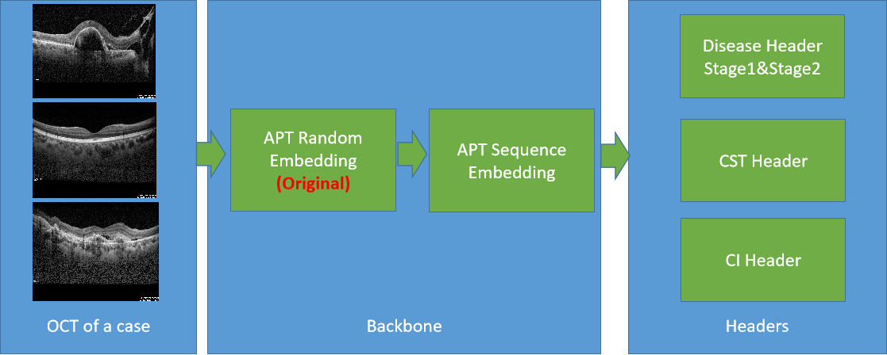
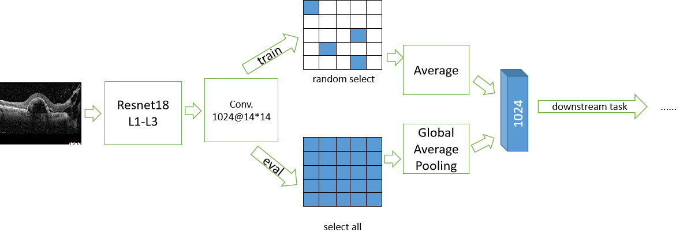
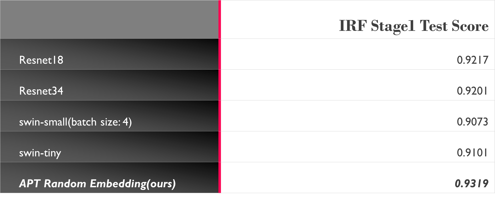

# APTOS Big Data Competition from Aliyun Tianchi

## Project Overview

This project presents our solution developed for the APTOS Big Data Competition on Aliyun Tianchi, focused on automated retinal disease analysis from OCT images to improve diagnostic accuracy.

## Key Challenges in Retinal OCT Analysis

The competition involved four key challenges, each demanding specific solutions:

*   **Retinal Disease Detection:**  Identifying IRF, SRF, HRF, and PED.  **Challenge:** Subtle indicators, especially HRF.
*   **Central Subfield Thickness (CST) Measurement:** Quantifying CST. **Challenge:** Image variability and case-level ground truth.
*   **Continue Injection (CI) Prediction:**  Predicting need for continued therapy. **Challenge:** Modeling temporal disease progression from pre/post-treatment scans.
*   **Visual Acuity (VA) Assessment:** Estimating VA. **Challenge:** Complexity and limited OCT-image predictability.

## Our Innovative Approach: The APT Model

To address these, we created the **APT model**, a novel deep learning framework featuring:

*   **APT Embedding:** Custom ResNet18-inspired module for enhanced OCT feature extraction.

*   **Sequence Embedding:** Transformer-based architecture for inter-image context in cases.
*   **Specialized Augmentation:** Targeted techniques like "random expansion" and BYOL pretraining augmentations.
*   **Regression-to-Classification CST:**  Novel approach for improved CST prediction.
*   **Multi-Model Ensembling:** Robust performance through combined predictions.
*   **BYOL Pretraining:** Self-supervised pretraining for enhanced generalization.

## Competition Results

We are proud to share our results in the **2021 Tianchi Global AI Series Challenge -- APTOS Asia Pacific Tele-Ophthalmology Society Big Data Competition**:

*   **Preliminary Round:** 2nd Place (out of 10,000+ teams)
*   **Final Round:** 4th Place
*   **Final Round (Defense):** 2nd Place

This achievement was accomplished as a **two-person team**, highlighting the collaborative effort and effectiveness of the developed APT model.

